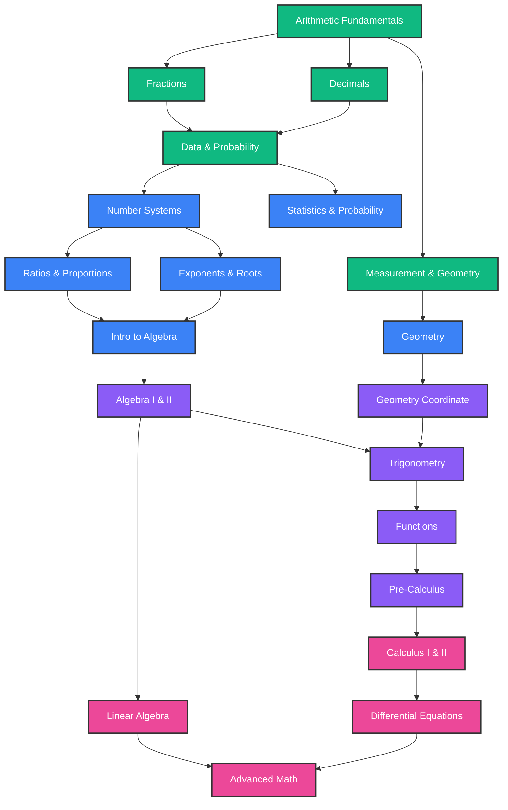

# Curriculum Overview - AsahFikir Math

AsahFikir uses a unified **Knowledge Graph** to represent mathematical concepts from grade 1 (elementary) to college and advanced levels. Users navigate through a map of nodes. Each node represents a specific subtopic, contains learning materials, interactive explorations, and a set of adaptive quizzes.

---

## 1. Educational Tracks & Modules

The curriculum is structured into four main tracks, representing a continuous progression of mathematical maturity:

| Track | Level Range | Key Modules | Focus Area |
| :--- | :--- | :--- | :--- |
| **Elementary** | Grades 1-6 | Arithmetic, Fractions, Decimals, Basic Geometry, Probability Intro | Concrete representations, number sense, and visual intuition. |
| **Middle School** | Grades 6-8 | Rationals, Ratios/Proportions, Exponents, Algebraic Thinking, Statistics | Transition to abstract variables, proportional relationships. |
| **High School** | Grades 9-12 | Algebra I & II, Coordinate Geometry, Trigonometry, Pre-Calculus, Functions | Formal algebraic structures, analytical geometry, functions. |
| **College** | Grade 13+ | Calculus I & II, Linear Algebra, Differential Equations, Abstract Math | Continuous systems, multi-dimensional structures, proof patterns. |

---

## 2. The Knowledge Graph Structure

Concepts are linked via **Prerequisite Directed Edges**. A user cannot unlock module $B$ unless they have achieved a threshold of mastery (e.g., $P(\text{Mastery}) \ge 0.8$) in all prerequisite modules $A_i$.

---

## 3. Adaptive Leveling System

Within each module, content is served dynamically using three levels of difficulty:

1. **Level 1 (Intuitive/Visual Exploration)**:
   - *Goal*: Build the initial mental model.
   - *Delivery*: Interactive slider animations, drag-and-drop visuals, and conceptual proofs without formula-heavy text.
2. **Level 2 (Applied/Procedural Mastery)**:
   - *Goal*: Bridge the visual model with symbol manipulation.
   - *Delivery*: Medium-difficulty quizzes, matching questions, parameter tuning, and basic calculations.
3. **Level 3 (Conceptual Challenges)**:
   - *Goal*: Verify abstract generalization and problem-solving resilience.
   - *Delivery*: Hard quizzes, multi-step problem solving, and edge-case interactive sandboxes (e.g. infinite values, singular matrices).

---

## 4. Mastery Computation & Transition

Adaptive decisions are handled in real-time on the client:
- **Starting Point**: Users can take a diagnostic placement test to set initial mastery levels or choose a track.
- **Dynamic Transition**: If a user answers Level 1 questions with high accuracy and low response time, the system raises the node mastery probability. Once mastery exceeds 0.7, the system begins injecting Level 2 and Level 3 questions.
- **Active Spaced Repetition**: Completed nodes are scheduled for review. If user performance drops during a review session, the system lowers the mastery status and serves simpler concept refreshers.
